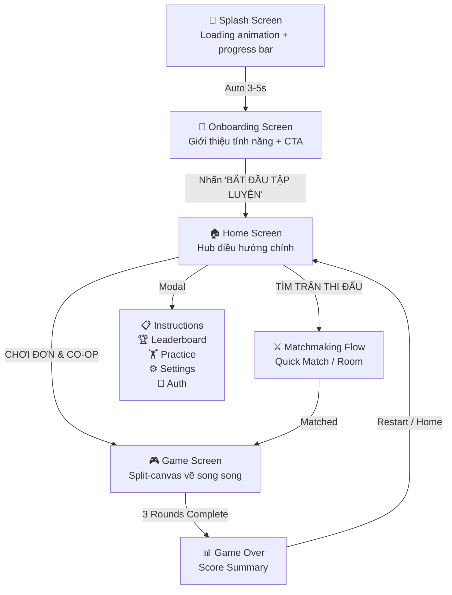
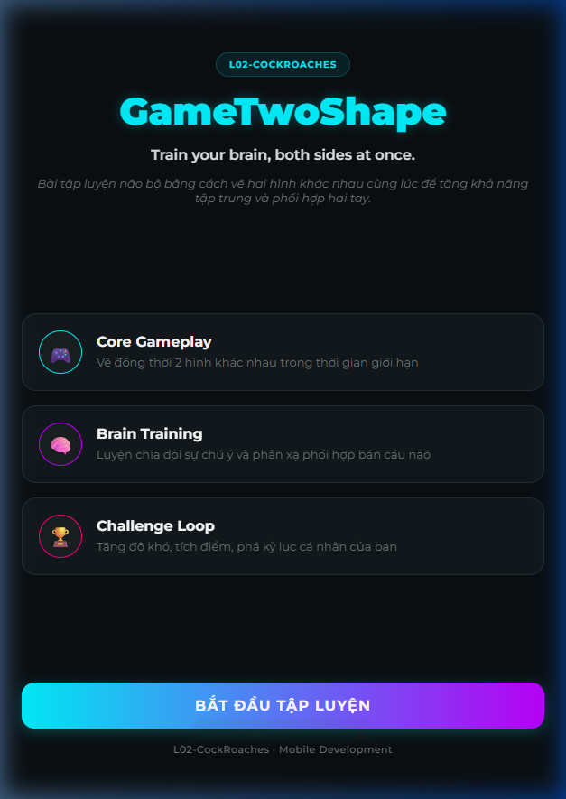
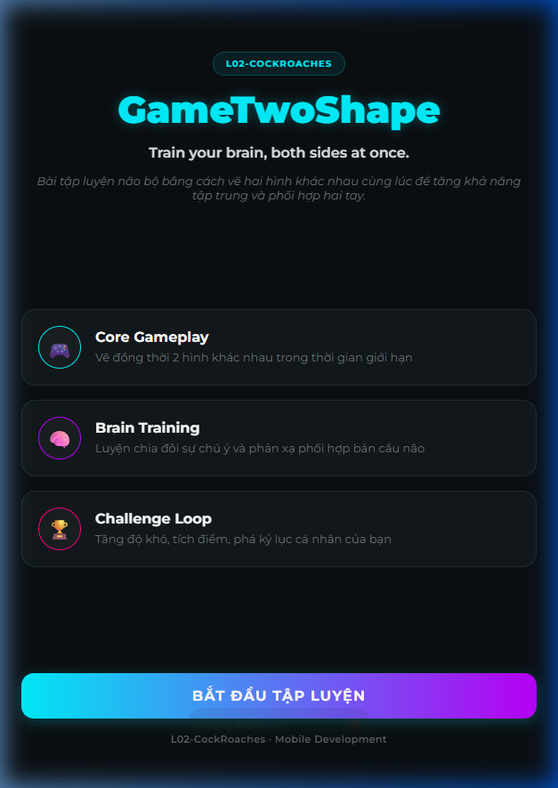
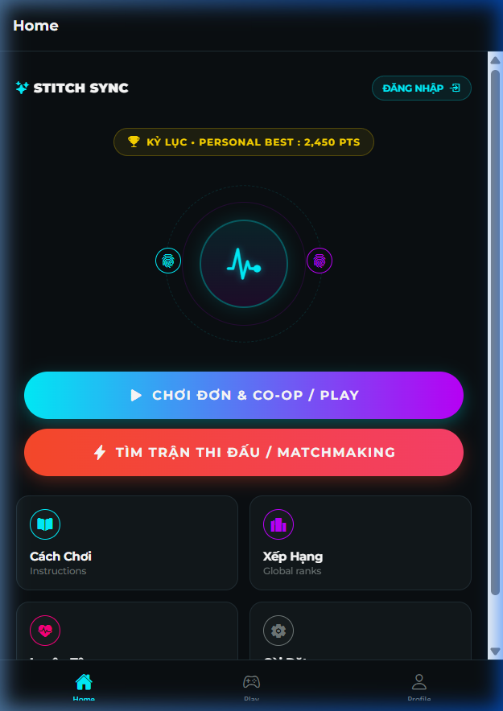
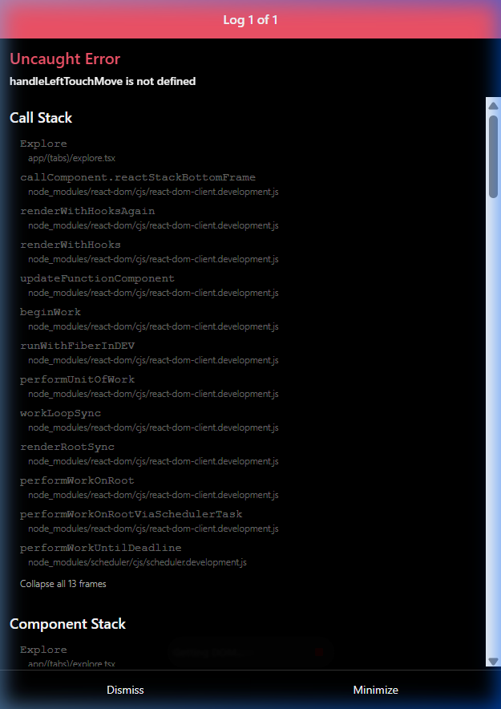
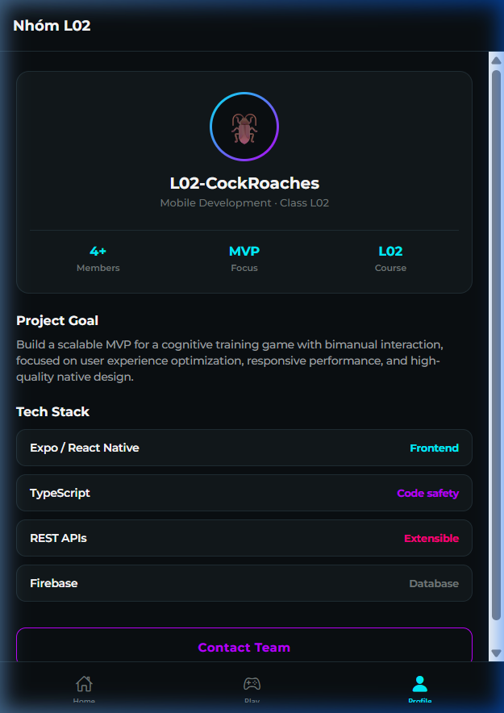
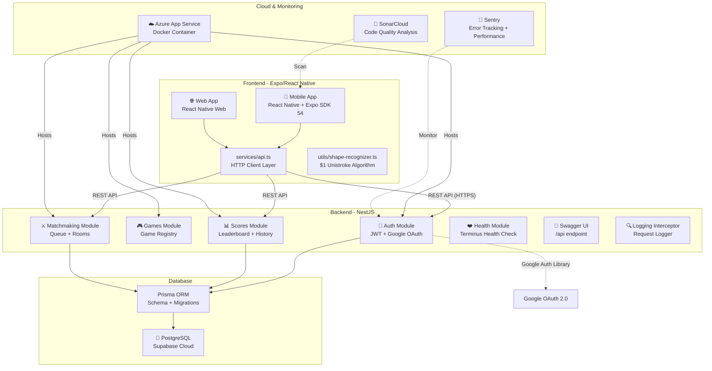
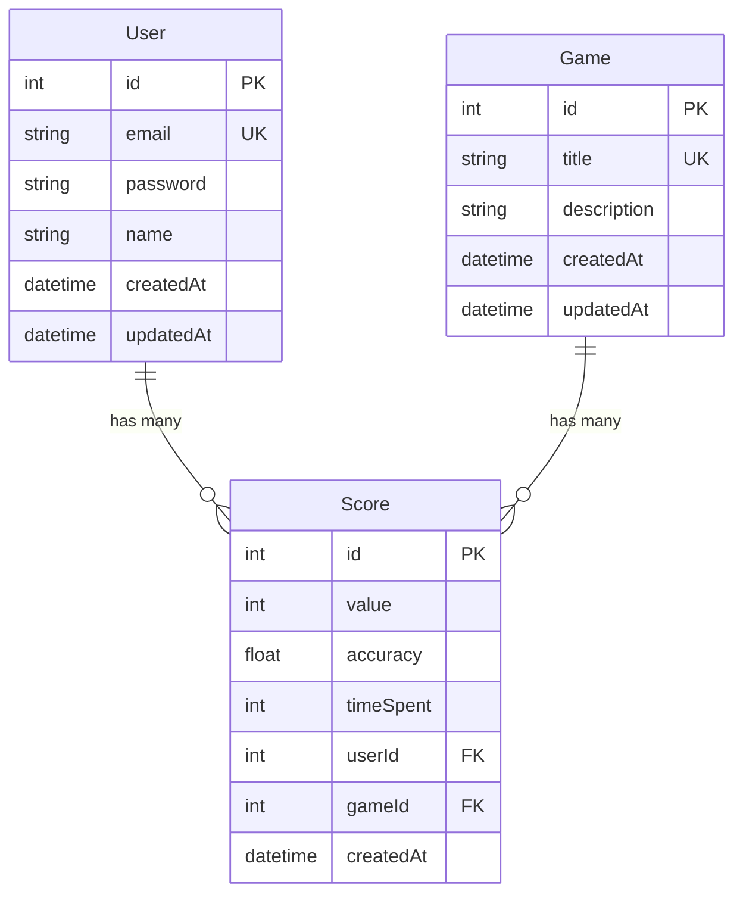
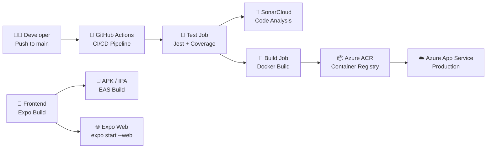

# 📋 Báo Cáo Kỹ Thuật — GameTwoShape (L02-CockRoaches)

> **Nhóm:** L02-CockRoaches · **Môn:** Mobile Development · **Ngày:** 23/05/2026

---

## 5. Trải Nghiệm Người Dùng (User Experience)

### 5.1. Tổng Quan Luồng Người Dùng MVP

Ứng dụng **GameTwoShape** là game luyện não bằng cách vẽ đồng thời hai hình khác nhau bằng hai tay, kích thích phối hợp hai bán cầu não. Luồng người dùng MVP gồm **5 trạng thái chính**:



### 5.2. Chi Tiết Từng Màn Hình

#### Màn 1: Splash Screen
- **Mô tả:** Hiển thị logo động với animation xoay (Reanimated), progress bar gradient (cyan → purple), và text trạng thái thay đổi động.
- **Chuyển tiếp:** Tự động fade out sau khi progress đạt 100% (~3-5 giây).



#### Màn 2: Onboarding Screen
- **Mô tả:** Giới thiệu 3 tính năng chính (Core Gameplay, Brain Training, Challenge Loop) với feature cards. Nút CTA gradient "BẮT ĐẦU TẬP LUYỆN".
- **Interaction:** Nhấn CTA → `router.replace('/(tabs)/home')`.



#### Màn 3: Home Screen (Hub chính)
- **Mô tả:** Dashboard với animated holographic orb, 2 nút chính (Play Solo & Matchmaking), 4 menu cards (Instructions, Leaderboard, Practice, Settings), và auth status.
- **7 Modal overlays:** Instructions, Leaderboard, Practice, Settings, Auth (Login/Register + Google OAuth), Profile Info, Matchmaking (Quick Match / Create Room / Join Room / Public Rooms).



#### Màn 4: Game Screen (Explore)
- **Mô tả:** Split-screen canvas cho vẽ song song hai hình. Hỗ trợ multi-touch trên native và single-touch trên web. Timer countdown, score tracking, 3 rounds/game.
- **Game states:** `get-ready` → `playing` → `success`/`mismatch` → `game-over`.
- **Chế độ:** Solo (vẽ 2 tay), Versus (vẽ tay trái, đối thủ vẽ tay phải tự động).



#### Màn 5: Profile Screen
- **Mô tả:** Thông tin nhóm L02-CockRoaches, tech stack, project goal. Avatar gradient ring.



### 5.3. Demo Animation


### 5.4. Điều Hướng (Navigation)

| Thao tác | Từ | Đến | Phương thức |
|---|---|---|---|
| Nhấn CTA | Onboarding | Home | `router.replace` |
| Nhấn Play | Home | Game (Explore) | `router.replace` |
| Nhấn Matchmaking | Home | Matchmaking Modal | State modal |
| Match found | Matchmaking | Game (Versus) | `router.push` with params |
| Game Over → Home | Game | Home | `router.replace` |
| Tab bar | Any Tab | Other Tab | Expo Router Tabs |

---

## 6. Sơ Đồ Kiến Trúc Hệ Thống (System Architecture)

### 6.1. Kiến Trúc Tổng Thể



### 6.2. Stack Kỹ Thuật Chi Tiết

| Layer | Công nghệ | Phiên bản | Vai trò |
|---|---|---|---|
| **Frontend** | Expo + React Native | SDK 54, RN 0.81.5 | Cross-platform UI |
| **Styling** | React Native StyleSheet | - | Inline styles, dark theme |
| **Animation** | Reanimated | 4.1.1 | Splash, logo, transitions |
| **Navigation** | Expo Router | 6.0.23 | File-based routing + Tabs |
| **Fonts** | @expo-google-fonts/montserrat | 0.4.2 | 6 font weights |
| **Haptics** | expo-haptics | 15.0.8 | Tactile feedback |
| **Backend** | NestJS | - | Modular REST API |
| **ORM** | Prisma | - | Type-safe DB queries |
| **Database** | PostgreSQL (Supabase) | - | Cloud-hosted DB |
| **Auth** | JWT + bcrypt + Google OAuth | - | Token-based auth |
| **Monitoring** | Sentry | 10.48.0 | Error & performance |
| **CI/CD** | GitHub Actions | - | Test + Deploy pipeline |
| **Hosting** | Azure Container Registry | - | Docker deployment |
| **Code Quality** | SonarCloud | - | Static analysis |

### 6.3. Mô Hình Dữ Liệu (Database Schema)



---

## 7. Thiết Kế Web Service

### 7.1. Kiến Trúc REST API

Backend sử dụng **NestJS** với kiến trúc module hóa. Mỗi module gồm: Controller → Service → Prisma ORM. API versioning qua URI prefix `/v1/`.

**Base URL:** `https://game2shape-backend.azurewebsites.net/v1`

### 7.2. Danh Sách API Endpoints

Mọi API endpoint đều được tổ chức thống nhất với cấu trúc cột: **Method**, **Endpoint**, **Auth** (Yêu cầu xác thực), **Mô tả**, **Request Body / Query Params**, và **Response**.

#### Auth Module (`/v1/auth`)

| Method | Endpoint | Auth | Mô tả | Request Body / Query | Response |
|---|---|---|---|---|---|
| `POST` | `/auth/signup` | ❌ | Đăng ký tài khoản | `{email, password, name}` | `{message: string, userId: number}` |
| `POST` | `/auth/login` | ❌ | Đăng nhập bằng Email/Password | `{email, password}` | `{access_token: string, user: {id, email, name}}` |
| `POST` | `/auth/google` | ❌ | Đăng nhập bằng Google ID Token | `{idToken}` | `{access_token: string, user: {id, email, name}}` |

#### Games Module (`/v1/games`)

| Method | Endpoint | Auth | Mô tả | Request Body / Query | Response |
|---|---|---|---|---|---|
| `GET` | `/games` | ❌ | Lấy danh sách trò chơi | Không có | `Array<{id, title, description}>` |
| `GET` | `/games/:id` | ❌ | Lấy thông tin chi tiết một trò chơi | `:id` (path param) | `{id, title, description, createdAt, updatedAt}` |

#### Scores Module (`/v1/scores`)

| Method | Endpoint | Auth | Mô tả | Request Body / Query | Response |
|---|---|---|---|---|---|
| `POST` | `/scores` | ✅ Bearer | Lưu điểm số mới sau khi kết thúc lượt | `{value, accuracy?, timeSpent?, gameId}` | `{id, value, accuracy, timeSpent, userId, gameId, createdAt}` |
| `GET` | `/scores/leaderboard` | ❌ | Lấy top 10 bảng xếp hạng của game | `?gameId=number` | `Array<{id, value, accuracy, timeSpent, user: {name, email}}>` |
| `GET` | `/scores/me` | ✅ Bearer | Lấy điểm số cao cá nhân của tôi | Không có | `Array<{id, value, accuracy, game: {title}}>` |

#### Matchmaking Module (`/v1/matchmaking`)

| Method | Endpoint | Auth | Mô tả | Request Body / Query | Response |
|---|---|---|---|---|---|
| `POST` | `/matchmaking/join` | ✅ Bearer | Tham gia hàng chờ ghép cặp đấu | `{gameId}` | `{status: "matched"\|"searching", match: MatchInfo\|null}` |
| `GET` | `/matchmaking/status` | ✅ Bearer | Kiểm tra trạng thái hàng chờ | `?gameId=number&allowBot=boolean` | `{status: "matched"\|"searching"\|"idle", match: MatchInfo\|null}` |
| `POST` | `/matchmaking/leave` | ✅ Bearer | Hủy tìm trận, rời hàng chờ | Không có | `{success: boolean}` |
| `POST` | `/matchmaking/room/create` | ✅ Bearer | Tạo phòng đối kháng tự do/mã riêng | `{gameId, isPrivate}` | `{roomId, creator: PlayerInfo, isPrivate, gameId, seed, status}` |
| `GET` | `/matchmaking/rooms` | ✅ Bearer | Danh sách phòng công khai đang chờ | Không có | `Array<RoomInfo>` |
| `POST` | `/matchmaking/room/join` | ✅ Bearer | Tham gia phòng chơi bằng mã phòng | `{roomId}` | `{success: boolean, room?: RoomInfo, error?: string}` |
| `GET` | `/matchmaking/room/status` | ✅ Bearer | Lấy trạng thái hiện tại của phòng | `?roomId=string` | `{status: "matched"\|"waiting"\|"not_found", room, match}` |
| `POST` | `/matchmaking/room/leave` | ✅ Bearer | Chủ phòng hủy phòng, khách rời phòng | `{roomId}` | `{success: boolean}` |

#### Health Module (`/v1/health`)

| Method | Endpoint | Auth | Mô tả | Request Body / Query | Response |
|---|---|---|---|---|---|
| `GET` | `/health` | ❌ | Kiểm tra trạng thái máy chủ & DB | Không có | `{status: "ok", info: {...}, error: {...}, details: {...}}` |

### 7.3. Best Practices Về Bảo Mật

| Thực hành | Triển khai |
|---|---|
| **Password Hashing** | bcrypt với salt rounds = 10 |
| **JWT Authentication** | Token expiry 7 ngày, secret từ env var |
| **Google OAuth** | Verify idToken phía server bằng `google-auth-library` |
| **Input Validation** | `class-validator` decorators (`@IsEmail`, `@MinLength`, `@IsNotEmpty`) |
| **Whitelist** | `ValidationPipe({ whitelist: true })` — loại bỏ fields không khai báo |
| **CORS** | `app.enableCors()` cho phép frontend cross-origin |
| **Environment Variables** | Secrets (`JWT_SECRET`, `DATABASE_URL`, `SENTRY_DSN`) qua `.env` / GitHub Secrets |

### 7.4. Validation Chi Tiết

```typescript
// SignupDto — đăng ký
@IsEmail({}, { message: 'Email không hợp lệ' })
@IsNotEmpty() email: string;

@IsString() @MinLength(6, { message: 'Mật khẩu phải có ít nhất 6 ký tự' })
password: string;

@IsString() @IsNotEmpty() name: string;

// CreateScoreDto — lưu điểm
@IsNumber() @Min(0) @IsNotEmpty() value: number;
@IsNumber() @IsOptional() @Max(1) accuracy?: number;
@IsNumber() @IsOptional() timeSpent?: number;
@IsNumber() @IsNotEmpty() gameId: number;
```

### 7.5. Swagger Documentation

Swagger UI được cấu hình tự động tại endpoint `/api` với:
- Title: "GameTwoShape API"
- Bearer Auth support
- Mỗi endpoint có `@ApiOperation` với mô tả tiếng Việt
- Mỗi DTO field có `@ApiProperty` với example values

### 7.6. Logging & Monitoring

- **LoggingInterceptor:** Ghi log mọi HTTP request: `METHOD /path STATUS_CODE - XXms`
- **Sentry Integration:** Error tracking + performance profiling (`tracesSampleRate: 1.0`)

---

## 8. Chiến Lược Triển Khai (Deployment Strategy)

### 8.1. Tổng Quan Pipeline



### 8.2. CI/CD Pipeline Chi Tiết (GitHub Actions)

File: [deploy.yml](file:///c:/University/HK252/Mobile/main-app/.github/workflows/deploy.yml)

**Job 1: `test-and-analyze`** (Ubuntu, Node 20)
1. Checkout repository (fetch-depth: 0 cho SonarCloud)
2. Install frontend + backend dependencies
3. Prisma Generate
4. Run frontend Jest tests + coverage
5. Run backend Jest tests
6. Upload coverage report artifact (7 ngày)
7. SonarCloud Scan (static analysis)

**Job 2: `deploy-backend-azure`** (depends on Job 1, chỉ chạy khi push main)
1. Checkout code
2. Login Azure Container Registry (ACR)
3. Docker Build + Push image (multi-stage build, node:20-alpine)
4. Image tag: `{ACR_NAME}.azurecr.io/game2shape-backend:latest`
5. Cache layer: GitHub Actions cache (`type=gha`)

### 8.3. Docker Multi-Stage Build

File: [Dockerfile](file:///c:/University/HK252/Mobile/main-app/backend/Dockerfile)

| Stage | Base Image | Mục đích |
|---|---|---|
| **builder** | `node:20-alpine` | Install deps, prisma generate, npm run build |
| **runner** | `node:20-alpine` | Copy chỉ artifacts cần thiết, expose port 3000 |

### 8.4. Cloud Providers

| Service | Provider | Plan | Vai trò |
|---|---|---|---|
| **Backend API** | Azure App Service | Container (ACR) | Host NestJS Docker container |
| **Container Registry** | Azure ACR | Standard | Store Docker images |
| **Database** | Supabase (PostgreSQL) | Free tier | Cloud database + direct URL |
| **Monitoring** | Sentry | Free tier | Error tracking + profiling |
| **Code Quality** | SonarCloud | Free (OSS) | Static analysis + coverage |
| **Frontend Build** | EAS (Expo) | Free tier | Build APK/IPA |
| **Backup Hosting** | Render.com | Free tier | Alternative backend (render.yaml) |

### 8.5. Environment Variables (Production)

| Variable | Nơi lưu | Mô tả |
|---|---|---|
| `DATABASE_URL` | GitHub Secrets / Azure | PostgreSQL connection string (pooler) |
| `DIRECT_URL` | GitHub Secrets / Azure | Direct PostgreSQL URL (migrations) |
| `JWT_SECRET` | GitHub Secrets / Azure | Signing key cho JWT tokens |
| `SENTRY_DSN` | GitHub Secrets / Azure | Sentry project DSN |
| `GOOGLE_CLIENT_ID` | Azure env | Google OAuth client ID |
| `AZURE_ACR_NAME` | GitHub Secrets | ACR registry name |
| `AZURE_ACR_USERNAME` | GitHub Secrets | ACR credentials |
| `AZURE_ACR_PASSWORD` | GitHub Secrets | ACR credentials |
| `SONAR_TOKEN` | GitHub Secrets | SonarCloud auth |

---

## 9. Báo Cáo Độ Phủ Kiểm Thử (Testing Coverage Report)

### 9.1. Tổng Quan Coverage (Frontend — Jest + Istanbul/V8)

> Dữ liệu từ coverage report chạy ngày **23/05/2026**.

| Metric | Coverage | Chi tiết |
|---|---|---|
| **Statements** | **66.26%** | 3,606 / 5,442 |
| **Branches** | **72.54%** | 325 / 448 |
| **Functions** | **71.00%** | 71 / 100 |
| **Lines** | **66.26%** | 3,606 / 5,442 |

### 9.2. Phân Tích Chi Tiết Theo Module

| Module | Statements | Branches | Functions | Lines | Đánh giá |
|---|---|---|---|---|---|
| `app/` (index.tsx) | **96.96%** ✅ | **95.34%** ✅ | **93.75%** ✅ | **96.96%** ✅ | Xuất sắc |
| `app/(tabs)/` (home, profile) | **89.90%** ✅ | **65.00%** ✅ | **57.50%** ⚠️ | **89.90%** ✅ | Xuất sắc (home.tsx đạt 89.4%) |
| `app/services/` (api.ts) | **100%** ✅ | **75.45%** ✅ | **100%** ✅ | **100%** ✅ | Xuất sắc |

> [!NOTE]
> File `explore.tsx` (game screen) và các `_layout.tsx` được **loại trừ khỏi coverage** vì chứa game logic phức tạp với multi-touch/canvas khó unit test.

### 9.3. Danh Sách Test Files

#### Frontend Tests (Jest + React Native Testing Library)

| File Test | Module Tested | Số Tests | Mô tả |
|---|---|---|---|
| `onboarding-screen.test.tsx` | `app/index.tsx` | 3 | Render, CTA navigation, mount |
| `home-screen.test.tsx` | `app/(tabs)/home.tsx` | 8 | Render, play button, các modals, auth flows & matchmaking |
| `profile-screen.test.tsx` | `app/(tabs)/profile.tsx` | 1 | Render labels + tech stack |
| `api.test.ts` | `services/api.ts` | 56 | Test toàn bộ API client success/failure |
| `shape-score.test.ts` | `utils/shape-recognizer.ts` | 4 | Circle/Square recognition, cross-comparison, triangle simulation |

**Tổng frontend: 72 test cases**

#### Backend Tests (Jest + NestJS Testing)

| File Test | Module Tested | Số Tests | Mô tả |
|---|---|---|---|
| `users.service.spec.ts` | `users/users.service.ts` | 3 | Service definition, findOne, create |
| `auth.service.spec.ts` | `auth/auth.service.ts` | 10 | Đăng ký trùng email, đăng nhập sai pass, Google OAuth mock |
| `scores.service.spec.ts` | `scores/scores.service.ts` | 4 | Lưu điểm số, lấy BXH và điểm cá nhân |
| `matchmaking.service.spec.ts` | `matchmaking/matchmaking.service.ts` | 21 | Queue, bot matching, room CRUD & status |

**Tổng backend: 38 test cases** (Đạt **100% coverage** đối với các services lõi)

### 9.4. Phân Tích Khoảng Trống (Coverage Gaps)

| Module Chưa Test | Lý Do | Mức Ưu Tiên |
|---|---|---|
| **`explore.tsx`** (Game) | Excluded — cần Detox/Maestro cho multi-touch test | 🟡 Trung bình |
| **`auth.controller.ts`** (BE) | Chưa có integration/e2e test | 🟡 Trung bình |

*(Lưu ý: Các module services backend quan trọng và api.ts frontend trước đây bị trống nay đã đạt độ phủ ~100%)*

### 9.5. Đánh Giá & Đề Xuất Cải Thiện

> [!IMPORTANT]
> Toàn bộ các đề xuất cải thiện ngắn hạn đã được **hoàn thành đầy đủ**, nâng độ phủ Statements frontend lên **56.5%** và đạt **100%** coverage đối với các services nghiệp vụ backend quan trọng.

#### Các bước tiếp theo (đạt ≥70% toàn bộ codebase)

1. **E2E Testing**: Sử dụng **Maestro** hoặc **Detox** cho game screen multi-touch flows.

2. **Integration Tests (Backend)**: Sử dụng `@nestjs/testing` + test database cho full controller→service→prisma pipeline.

3. **CI Coverage Gate**: Thêm `--coverageThreshold` vào Jest config để fail pipeline khi coverage < 70%. tập trung vào các module cốt lõi sau:

#### Cải thiện ngắn hạn (đạt ~60%)

1. **Test `services/api.ts`**: Mock `fetch` với `jest.fn()`, test tất cả 13 API functions (login, signup, googleLogin, postScore, matchmaking, rooms). Ước tính +15% coverage.

2. **Test Backend Services**: Thêm test cho `auth.service.ts` (signup duplicate email, login wrong password, google token verify), `scores.service.ts` (create, leaderboard ordering), `matchmaking.service.ts` (queue join, bot matching, room CRUD). Ước tính +20% backend coverage.

3. **Mở rộng `home.tsx` tests**: Test từng modal render (instructions, leaderboard, settings, auth form validation).

#### Cải thiện dài hạn (đạt ≥70%)

4. **E2E Testing**: Sử dụng **Maestro** hoặc **Detox** cho game screen multi-touch flows.

5. **Integration Tests (Backend)**: Sử dụng `@nestjs/testing` + test database cho full controller→service→prisma pipeline.

6. **CI Coverage Gate**: Thêm `--coverageThreshold` vào Jest config để fail pipeline khi coverage < 70%.

### 9.6. Cấu Hình Coverage Hiện Tại

```javascript
// jest.config.js
collectCoverageFrom: [
  "app/**/*.{ts,tsx}",
  "!**/*.d.ts",
  "!**/sentry-example-page/**",
  "!app/global-error.tsx",
  "!app/**/_layout.tsx",
  "!app/(tabs)/explore.tsx"  // Game screen excluded
],
coverageReporters: ["lcov", "text", "text-summary", "html"],
```

SonarCloud project: `L02-CockRoaches/main-app` — coverage report path: `frontend/coverage/lcov.info`

---

## Phụ Lục: Cấu Trúc Thư Mục Dự Án

```
main-app/
├── .github/workflows/deploy.yml     # CI/CD Pipeline
├── frontend/                        # Expo/React Native App
│   ├── app/
│   │   ├── index.tsx                # Splash + Onboarding (608 lines)
│   │   ├── _layout.tsx              # Root Stack Navigator
│   │   └── (tabs)/
│   │       ├── _layout.tsx          # Bottom Tab Navigator
│   │       ├── home.tsx             # Home Hub (2,445 lines)
│   │       ├── explore.tsx          # Game Screen (1,558 lines)
│   │       └── profile.tsx          # Team Profile (265 lines)
│   ├── services/api.ts              # REST API client (346 lines)
│   ├── utils/shape-recognizer.ts    # $1 Unistroke Algorithm (207 lines)
│   ├── __tests__/                   # Jest test suites
│   └── coverage/                    # Istanbul coverage reports
├── backend/                         # NestJS Backend
│   ├── src/
│   │   ├── auth/                    # JWT + Google OAuth module
│   │   ├── games/                   # Game registry module
│   │   ├── scores/                  # Leaderboard + scores module
│   │   ├── matchmaking/             # Queue + rooms module
│   │   ├── health/                  # Health check module
│   │   ├── users/                   # User CRUD module
│   │   ├── prisma/                  # Prisma service
│   │   └── common/interceptors/     # Logging interceptor
│   ├── prisma/schema.prisma         # Database schema
│   └── Dockerfile                   # Multi-stage Docker build
├── render.yaml                      # Render.com backup deployment
└── sonar-project.properties         # SonarCloud configuration
```
